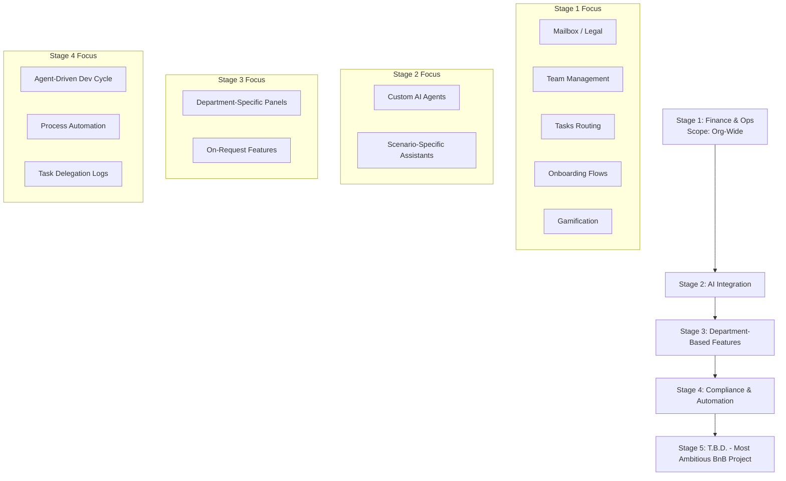

# bits&bytes Motherboard Application Roadmap

This roadmap defines the long-term evolution stages of the **bnb-motherboard** platform, as transcribed from the foundational whiteboard design session.

---

## Stage 1 — Finance & Operations (Current Focus)
The primary layout and logic focus on core financial operations, team coordination, and system user management.
* **Scope:** All users' scope and access controls are **org-wide**.
* **Key Modules:**
  * **Mailbox / Legal:** Inbox for legal documents, incoming regulatory communications, and official correspondence.
  * **Team:** Directory of local city forks, roles mapping, and guild membership.
  * **Tasks:** Operational task tracking, assignments, and ticket routing.
  * **Onboarding:** Member onboarding flows, verification checkpoints, and automatic Discord role setup.
  * **Gamification:** Community engagement incentives, badges, and contribution trackers.

---

## Stage 2 — Artificial Intelligence (AI)
Integrating multi-agent systems to support operational scaling and automated management.
* **Core Focus:** Building and coordinating autonomous AI agents.
* **Objective:** Deploying agents capable of assisting in various scenarios, programs, and team-specific flows.

---

## Stage 3 — Department-Based Features
Decentralizing platform features to cater directly to various bits&bytes departments.
* **Core Focus:** Building custom modules and panels on-demand for outreach, creative/design, tech/dev, and operations.
* **Objective:** Tailoring the plugin-sdk and dashboard features to department requests.

---

## Stage 4 — Compliance & Automation
Hardening operational security and automate continuous development cycles.
* **Core Focus:** 
  * **Agent-Driven Development Cycle:** Auto-generated pull requests, linting, tests, and self-fixing deployments.
  * **Automation:** End-to-end background processes without manual checkpoints.
  * **Delegation:** Dynamic, secure delegation systems (leveraging `@bnb/iam` delegation schemas).

---

## Stage 5 — T.B.D.
* **"The most ambitious bnb project ever!"** — Platform-level enhancements, network scale expansions, and decentralized city-fork governance engines.
